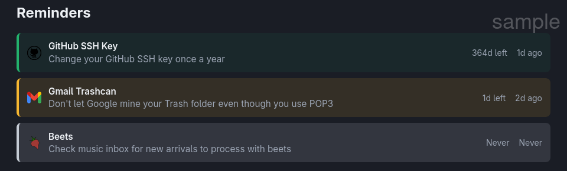
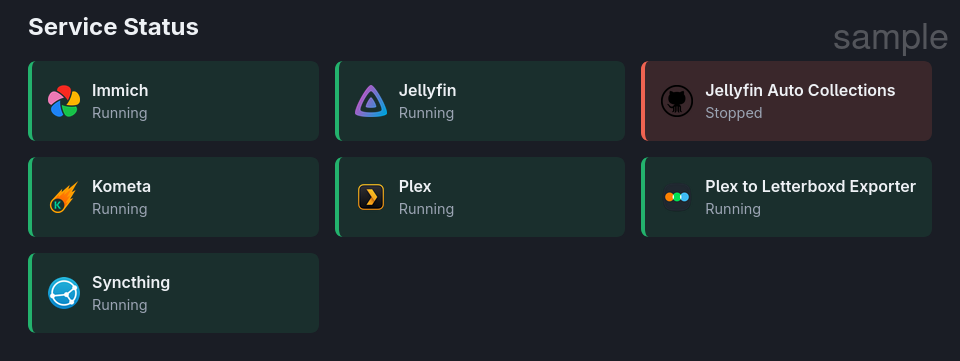
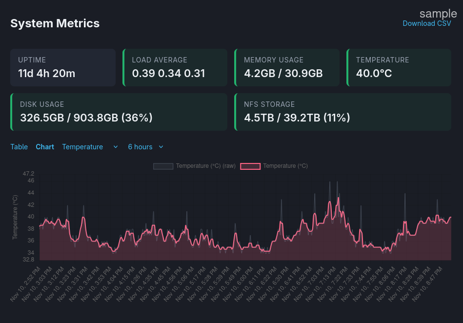
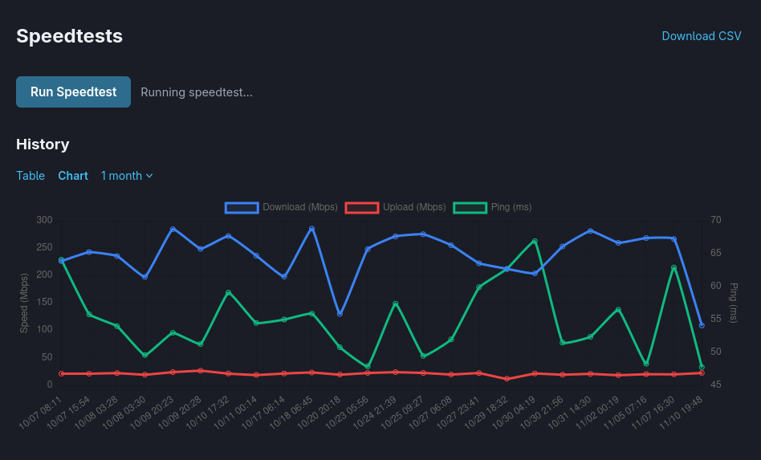
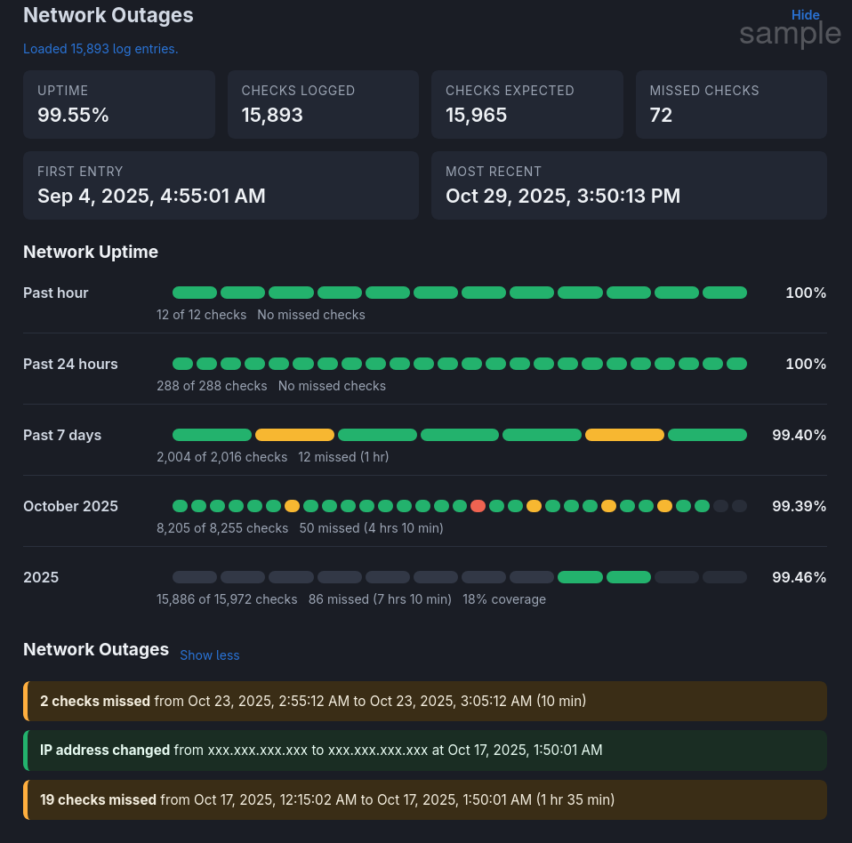

This file is **monitor@**'s `README`.  It's a useful reference when editing your own wiki/markdown files render by monitor@, as it has good coverage with markdown-it features.

<details>
<summary>Contents<br></summary>

[[toc]]

</details>

## Setup

```
├── README.md                   # this document
├── systemd
│   └── monitor@.service        # systemd template service for gunicorn
└── www/
    ├── app.js                  # frontend javascript
    ├── config_default.yaml     # default configuration
    ├── index.html              # web UI
    ├── monitor.py              # backend gunicorn/flask web server
    ├── requirements.txt        # flask, gunicorn
    ├── vendors/*.{js,css}      # markdown rendering (auto-downloaded)
    └── widgets/                # widget libraries
```

The `vendors/` are for rendering and styling markdown documents like `README.md` in HTML. These libraries are for markdown rendering and are automatically downloaded locally by `monitor.py` only once.

This README assumes you've placed **monitor@** in `/opt/monitor@/` and the configuration file in `/home/user/.config/monitor@/config.yaml`.
Both of these locations con be configured. 

**monitor@** uses the [**confuse**](https://github.com/beetbox/confuse) library,
originally written for [beets](https://github.com/beetbox/beets), because of its ergonomics and one-to-one mapping of YAML:API.
**confuse** also handles the config look-up hierarchy and seemless YAML merging. See [confuse's docs](http://confuse.readthedocs.org/en/latest/usage.html) for more info.

### Web server

The backend is [gunicorn](https://gunicorn.org/). Setup:
```bash
cd www
python3 -m venv .venv
source .venv/bin/activate
pip install -r requirements.txt
deactivate
```

Run manually:
```bash
source .venv/bin/activate
gunicorn --bind localhost:6161 monitor:app
```

The systemd unit file runs in this virtual environment. If running multiple instances,
you should adjust the port to avoid conflicts (e.g., `--bind localhost:6162`).

### Systemd service

Update `systemd/monitor@.service` with your paths, user, port, etc. then
```bash
INSTANCE="$HOSTNAME" # or other, or leave blank
sudo cp systemd/monitor@.service /etc/systemd/system/
sudo systemctl daemon-reload
sudo systemctl enable --now monitor@INSTANCE.service
```

## Web UI

Open `http://localhost:6161` or configure this through a reverse proxy.

### Configuration

These are the basic monitor@ settings for your system, assuming you want to put all icons,
data and the config file in `/home/user/.config/monitor@/`:

```yaml
site:
  name: "@my-nas"
  title: "System Monitor @my-nas"
  base_url: "https://example.com/my-nas"

paths:
  data: "/home/user/.config/monitor@/data/"
  img: "/home/user/.config/monitor@/img/"
  favicon: "/home/user/.config/monitor@/img/favicon.ico"

privacy:
  replacements:
    "example.com": "hidden.com"
    "my-nas": "box"
    "user": "alpha"
    "scraper": "beta"
  mask_ips: true
```
The privacy mask helps share your setup online without exposing personal information. Those are just string replacements; add as many as you like.

### Widgets

**monitor@** uses a custom, extensible widget system. 

Available widgets:
- metrics
- network
- [reminders](#reminders)
- [services](#services)
- speedtest
- wiki

Example configuration:

```yaml
widgets:
  enabled: [ services, metrics, about, reminders, README ]
  network:
    name: "Network Status"
    enabled: false
  services:
    name: "Service Status"
    enabled: true
  metrics:
    name: "System Metrics"
    enabled: true
  README:
    type: wiki
    name: "README"
    enabled: true
    collapsible: true
    hidden: false
    doc: "/opt/monitor@my-nas/README.md"
  reminders:
    name: "Reminders"
    enabled: true
  about:
    type: wiki
    name: "wiki@my-nas"
    enabled: true
    collapsible: true
    hidden: false
    doc: "about.md"  # relative to www/
```

Each widget can be configured in its own YAML block.

#### Reminders

 

Example reminders (configure everything under `widgets.reminders`):

```
widgets:
  reminders:
    nudges: [ 14, 7 ]      # days before expiry to send gentle reminders
    urgents: [ 3, 1, 0 ]   # days before expiry to send urgent notifications  
    time: "21:00"          # daily check time (24h format)
    apprise_urls:
      - "pover://abscdefghijklmnopqrstuvwxyz1234@4321zyxwvutsrqponmlkjihgfedcba"
      - "mailto://1234 5678 9a1b 0c1d@sent.com?user=main@fastmail.com&to=alias@sent.com"
    items:
      beets:
        name: "Beets"
        url: "https://beets.example.com"
        icon: beets.png
        expiry_days: 14
        reason: "Check music inbox for new arrivals to process with beets"
      github:
        name: "GitHub SSH Key"
        url: "https://github.com/login"
        icon: github.png
        expiry_days: 365
        reason: "Change your GitHub SSH key once a year"
      google_mail:
        name: "Gmail Trashcan"
        url: "https://mail.google.com/"
        icon: gmail.png
        expiry_days: 3
        reason: |
          You use POP3 to forward gmail, but Google leaves a copy in its Trash can.
          Periodically clean it.
```

#### Services



The **Service Status** widget is a simple display to show what systemd service daemons and timers are running or have failed, and checks docker container health.

```yaml
widgets:
  services:
    enabled: true
    items:
      jellyfin:
        name: Jellyfin
        icon: jellyfin.png
        containers: [ "jellyfin" ]
        url: "https://example.com/jellyfin/"
        local: "http://my-nas:8096/jellyfin"

      immich:
        name: Immich
        icon: immich.webp
        containers:
          [
            "immich_server",
            "immich_machine_learning",
            "immich_microservices",
            "immich_postgres",
            "immich_redis"
          ]
        url: "https://immich.example.com/"
        local: "http://my-nas:2283"

      syncthing:
        name: Syncthing
        icon: syncthing.png
        services: [ "syncthing@user.service" ]
        url: "https://example.com/syncthing"
        local: "http://my-nas:8384"
```

You can configure these to have both your URL (or WAN IP) and a local address for use offline. **monitor@ is completely encapsulated and works offline when internet is down.**

#### Wiki

Some widgets you may want to use more than once. For two "wiki" documents to render in your monitor, use **`type: wiki`**. Using **`wiki: <title>`** may only be used once.

```yaml
widgets:
  about:
    type: wiki  
    name: "wiki@my-nas"
    enabled: true
    doc: "about.md"                          # relative to www/
  README:
    type: wiki
    name: "README"
    enabled: true
    collapsible: true
    hidden: false
    doc: "/opt/monitor@my-nas/README.md"     # absolute path
```

Then, you can change the order of widgets in the UI.

```yaml
widgets:
  enabled: 
    - services
    - metrics
    - about
    - reminders
    - README
```

#### Metrics



#### Speedtests



#### Network



## Contributing

```bash
pre-commit install
```
This will install [pre-commit](https://pre-commit.com/) hooks for linting and formatting for:
- YAML
- Python
- JavaScript

## License

[GPLv3](https://www.gnu.org/licenses/gpl-3.0.en.html)
