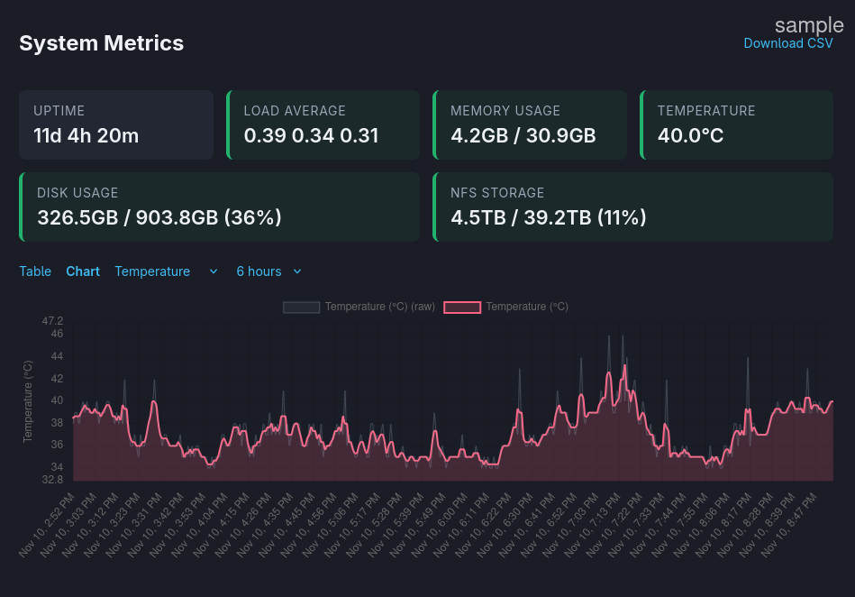
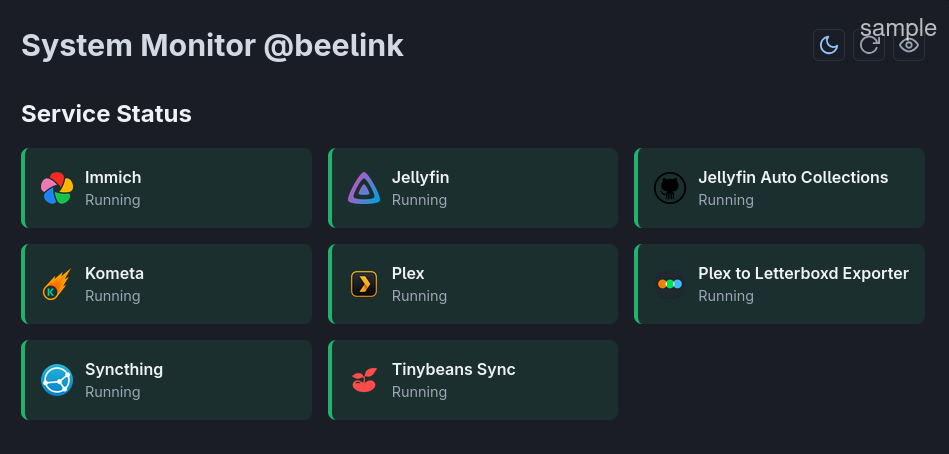
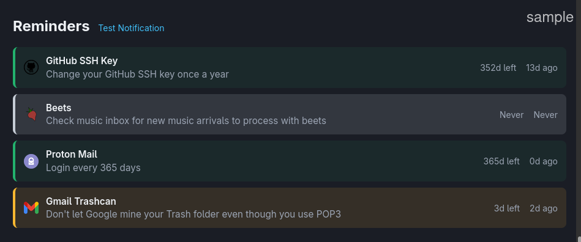
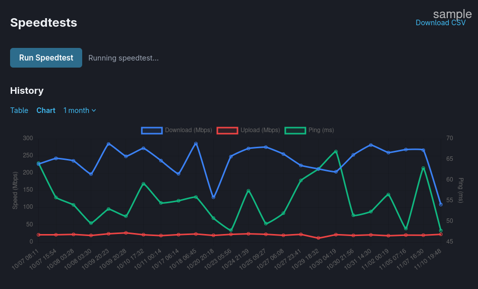
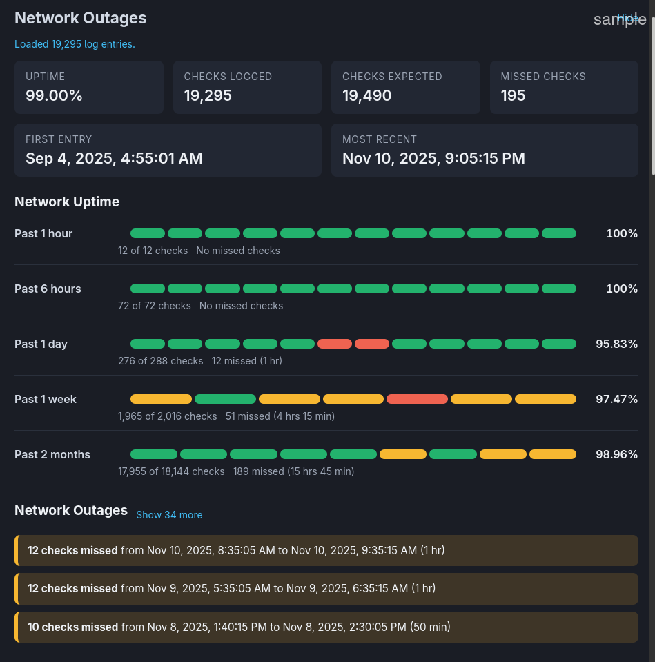

# <div align=center> [ [demo](https://monitorat.brege.org) ] </div>

Monitorat is a federated dashboard and documentation system with an extensible widget framework.
Its philosophy is to make system monitoring and documentation continuous, much like the way tables and figures are integrated in journal or news articles.

Available widgets:
- [metrics](#system-metrics)
- [network](#network)
- [reminders](#reminders)
- [services](#services)
- [speedtest](#speedtest)
- [wiki](#wiki)

Widgets have a general, self-contained structure where both API and UI are straightforward to create.

```
~/.config/monitorat/widgets/
└── my-widget
    ├── api.py
    ├── index.html
    └── app.js
```

Dashboard documentation is handled through through the Wiki widget. Each document snippet added is a new widget instance. This document and any others you add to your wiki will be rendered in GitHub-flavored markdown via [markdown-it](https://github.com/markdown-it/markdown-it).

### Gallery

It's best to checkout [the demo](https://monitorat.brege.org) which is a fully interactive version of the application you could be running on your machines. Screenshots of the demo are compiled below.

<!-- 
TODO: update screenshots 
4 + 2 + 4
4 - light mode phone
darkmode desktop + lightmode desktop
4 - darkmode desktop
use https://monitorat.brege.org/ to create screenshots
-->

<table>
  <tr>
    <td></td>
    <td></td>
    <td></td>
    <td></td>
  </tr>
</table>
<table>
  <tr>
    <td></td>
  </tr>
</table>

- See [how hot your CPU got today](https://monitorat.brege.org/#metrics-widget).
- Be alerted [when under high load](#alerts).
- Keep a record of and [graph your internet speed](https://monitorat.brege.org/#speedtest-widget).
- List of [all your reverse-proxied services](https://monitorat.brege.org/#services-widget) with offline-friendly bookmarks.

---

## Installation

Both the pip and uv installation methods assume you are using a configuration file at `~/.config/monitorat/config.yaml`.

### Installing with uv

##### **PyPI**

The simplest way is to install from PyPI.
```bash
curl -LsSf https://astral.sh/uv/install.sh | sh
uv tool install monitorat
```

##### **From Source**

Or install the package from source/development (use `-e` if you're developing widgets):
```bash
git clone https://github.com/brege/monitorat.git
cd monitorat
uv tool install -e .
```

In either case, start the server:
```bash
monitorat -c path/to/config.yaml server --host 0.0.0.0 --port 6161
```

or run the demos:
```bash
monitorat demo --mode simple      # single-instance dashboard
monitorat demo --mode advanced    # single-instance, with feature config examples
monitorat demo --mode federation  # multiple machines, and widget integration examples
```

which are also held on [monitorat.brege.org](https://monitorat.brege.org):
- [simple](https://monitorat.brege.org/)
- [advanced](https://monitorat.brege.org/advanced)
- [federation](https://monitorat.brege.org/federation)

Monitorat will resolve your config file either at the destination given by `-c|--config`, or the default location `~/.config/monitorat/config.yaml`.

##### Daemonizing with Systemd

Assuming you'd like to run monitorat as a systemd service with your normal user, group, and hostname:
```bash
bash <(curl -s https://raw.githubusercontent.com/brege/monitorat/refs/heads/main/scripts/install-systemd-uv.sh)
```
This pulls the uv-flavored systemd script from [scripts/install-systemd-uv.sh](./scripts/install-systemd-uv.sh), using sudo internally to install the systemd unit to `/etc/systemd/system/monitor@.service`.

### Installing with Docker

See: [Docker](./docs/docker.md) for running monitorat in a Docker container.

### Alternate Installs

See: [Alternate Installs](./docs/install.md) for traditional deployments at `/opt/monitorat`.

---

## The Dashboard

Open `http://localhost:6161`, or your specifed port, or configure through a reverse proxy.

### Configuration

These are the basic monitorat settings for your system, assuming you want to put all icons, data and the config file in `~/.config/monitorat/` which is the default location.

```yaml
site:
  name: "@my-nas"
  title: "Dashboard @my-nas"

paths:
  data: data/
  img: img/  # or /home/user/.config/monitorat/img/

widgets: { ... }

# privacy: { ... }
# alerts: { ... }
# notifications: { ... }
```

### Widgets

**monitorat** has an extensible widget system. You can add any number of widgets to your dashboard multiple times over, re-order them, and enable/disable any you don't need. You can add more widgets from others in `~/.config/monitorat/widgets/`.

```yaml
widgets:
  enabled:             # dashboard positions: from top to bottom
    - services
    - services-wiki    # type: wiki
    - metrics
    - metrics-wiki     # type: wiki
    - # reminders      # '#' disables this widget
    - network
    - speedtest
    - my-widget        # in ~/.config/monitorat/widgets/
```

Each widget can be configured in its own YAML block. To configure a widget in its own file,
```yaml
includes:
  - "/home/user/.config/monitorat/widgets/my-widget.yaml"
```
or do this for every widget through config snippets:
```yaml
includes:
  - include/services.yaml
  - include/metrics.yaml
  - include/reminders.yaml
  - include/network.yaml
  - include/speedtest.yaml
  - include/my-widget.yaml
  - # ... wikis, user widgets, etc
```

##### Making your own

They are also quite easy to build. Example of a widget built with Codex in 12 minutes:

- [Agentic Archetype: Building Widgets with AI](docs/contributing.md#agentic-archetype)

#### **Services**  
  The **Service Status** widget is a simple display to show what systemd service daemons, timers and docker containers are running or have failed. [GitHub](./demo/simple/docs/services.md) - [Demo](https://monitorat.brege.org/#services-widget)

  You can configure the service tiles to have both your URL (or WAN IP) and a local address (or LAN IP) for use offline. **monitorat is completely encapsulated and works offline even when internet is down.**

#### **Wiki**  
  Some widgets you may want to use more than once. For two markdown documents ("wikis"), use **`type: wiki`**. **`wiki: <title>`** may only be used once. [GitHub](./demo/README.md) - [Demo](https://monitorat.brege.org/#wiki)

   Changing widget order or enabling/disabling widgets is rather straightforward.

   ```yaml
   widgets:
     enabled: 
       - network
       - network-wiki
       - services
       - services-wiki
       - metrics
       - speedtest
       - ...
   ```

   **monitorat uses GitHub-flavored markdown**

#### **System Metrics**  
  Metrics provides an overview of system performance, including CPU, memory, disk and network usage, and temperature over time.  Data is logged to `metrics.csv`. [GitHub](./demo/simple/docs/metrics.md) - [Demo](https://monitorat.brege.org/#metrics-widget)

#### **Speedtest**  
  The **Speedtest** widget allows you to keep a record of your internet performance over time.
It does not perform automated runs. [GitHub](./demo/simple/docs/speedtest.md) - [Demo](https://monitorat.brege.org/#speedtest-widget)

#### **Network**  
  The **Network** widget may be the most specific. This example uses `ddclient`-style generated logs. [GitHub](./demo/simple/docs/network.md) - [Demo](https://monitorat.brege.org/#network-widget)

  The network widget is best used on machines with continuous uptime. You might even keep monitorat running on your pi-hole.

#### **Reminders**  
  The **Reminders** widget allows you to set reminders for system chores, login/key change reminders, and other one-offs chirps. [GitHub](./demo/simple/docs/reminders.md) - [Demo](https://monitorat.brege.org/#reminders-widget)

  Reminders are facilitated by [Apprise](https://github.com/caronc/apprise) (see [below](#notifications)).


### Privacy

The privacy mask helps share your setup online without exposing personal information. Those are just string replacements; add as many as you like.

```yaml
privacy:
  replacements:
    my-site.org: example.com
    my-hostname: masked-hostname
    ...
  mask_ips: true
```

Running
```bash
monitorat config
```
will print the runtime config with these masks applied.

### Alerts

Alerts are tied to system metrics, where you set a threshold and a message for each event.

<details>
<summary><b>Alerts</b> example configuration</summary>

```yaml
alerts:
  cooldown_minutes: 60  # Short cooldown for testing
  rules:
    high_load:
      threshold: 2.5    # load average (e.g., the '1.23' in 1.23 0.45 0.06)
      priority: 0       # normal priority
      message: High CPU load detected
    high_temp:
      threshold: 82.5   # celsius
      priority: 1       # high priority  
      message: High temperature warning
    low_disk:
      threshold: 95     # percent
      priority: 0       # normal priority
      message: Low disk space warning
```

</details>

### Notifications

The notifications system uses [Apprise](https://github.com/caronc/apprise) to notify through practically any service, via apprise URLs.

```yaml
notifications:
  apprise_urls:
    - "pover://abscdefghijklmnopqrstuvwxyz1234@4321zyxwvutsrqponmlkjihgfedcba"
    - "mailto://1234 5678 9a1b 0c1d@sent.com?user=main@fastmail.com&to=alias@sent.com"
    - # more apprise urls if needed...
```

---

## Contributors

- [**contributing**](./docs/contributing.md)

- [**changelog**](./docs/changelog.md)

- [**installation index**](./docs/install.md)

## License

[GPLv3](https://www.gnu.org/licenses/gpl-3.0.en.html)
