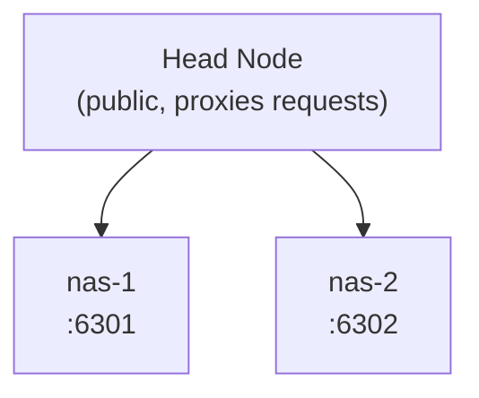

## Overview 

Prerequisites:

- Simple demo: [https://monitorat.brege.org/](https://monitorat.brege.org/)
- Advanced demo: [https://monitorat.brege.org/advanced/](https://monitorat.brege.org/advanced/)

Federation aggregates data from multiple monitorat instances into a unified view. This makes comparing metric data across two or more instances more continuous, allowing you to merge charts, mix reminders and service status, and pull documentation from multiple sources in one continuous display.

## How widgets can combine data in federation

Different widgets and widget features support different integrations.

| widget | feature | stack | columnate | merge |
| --- | --- | --- | --- | --- |
| wiki | document | ✔ | ✔ | ✖ |
| metrics | tiles | ✔ | ✔ | ✖ |
| metrics | history | ~ | ✖ | ✔ |
| services | cards  | ✔ | ✔ | ✔ |
| reminders | cards | ✔ | ✔ | ✔ |
| speedtest | chart/table | ~ | ✖ | ✔ |
| network | tiles | ✔ | ✔ | ✖ |
| network | uptime | ✔ | ✔ | ✖ |
| network | outages | ✖ | ✔ | ✔ |

Each federated widget declares its sources with, for example `federation.nodes: [nas-1, nas-2]`.

## Display Strategies

- **Stack** - Vertical sections
- **Columnate** - Side-by-side columns
- **Merge** - Combined or interleaved unified view

**Stacking** can always be done by using consecutive widgets of the same type, perhaps broken down into features, stacking feature-by-feature.

**Columnating** will only work on desktop. Mobile widgets and thin screens gracefully fall back to stacking when columnating is enabled.

**Merging** is data-driven: it allows data from multiple hosts to be combined into a single chart.
Merging can be used to interleave alerts and services cards, giving you a multi-sourced mix of apps and network failures, and reminders from a central command.


## Architecture



## Configuration

```yaml
federation:
  enabled: true
  remotes:
    - name: nas-1
      url: http://localhost:6301
      api_key: "secret"
    - name: nas-2
      url: http://localhost:6302
      api_key: "secret"
```
